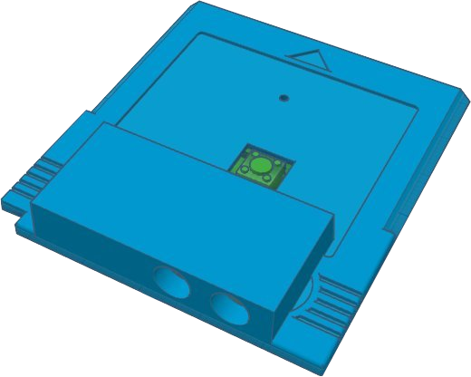
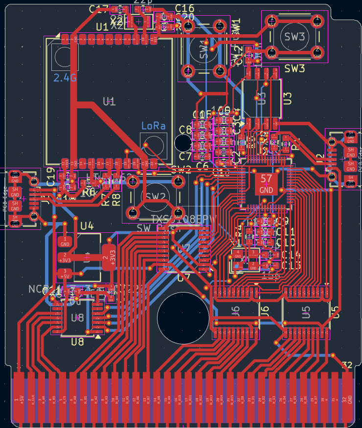
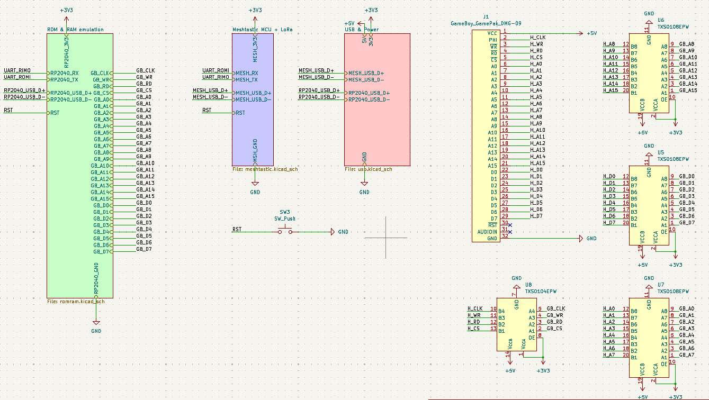
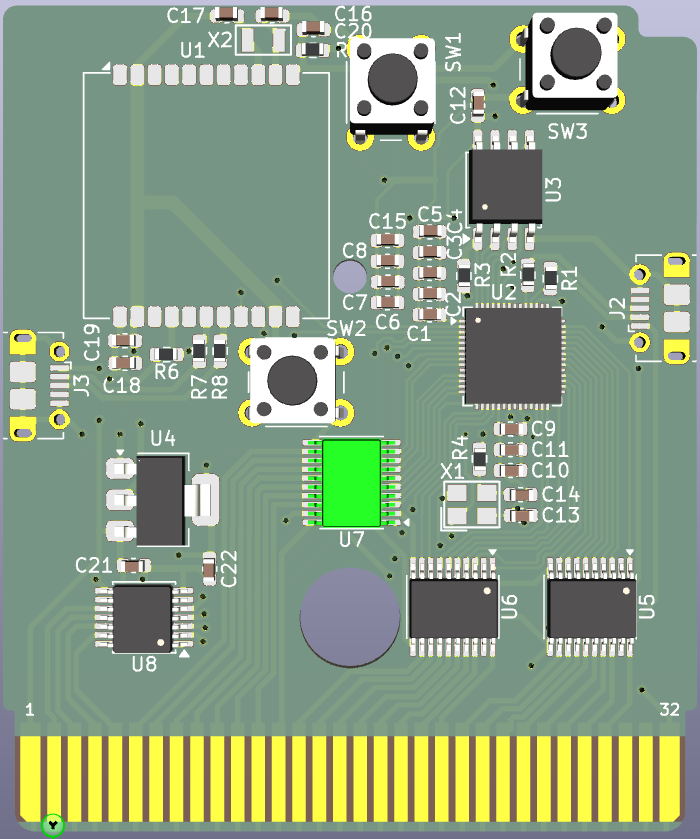

# meshboy
a meshtastic gameboy cartridge

## what is this? what does it do?

this is a cartridge that lets you chat in your local meshtastic network using your gameboy! it's got two antenna slots, first of which has to be a 2.4 ghz antenna and the second of which should be a lora antenna (with the frequency depending on the HT-CT62 model that you use). it's also got a ROM emulator with a custom ROM built specifically for this hardware that allows you to interface with the meshtastic controller chip, which in this case is an ESP32C3! and all of that runs on a gameboy!! isn't that just cool?

anyway here are some pics!!!

_pcb pic_

_schematic pic_

_3d render_

## how do i build one?

i haven't tried it myself yet, but you can theoretically build one of these using the provided BOM (`bom.xml`), gerber (`3d/gerbers.zip`) and 3d model files (`3d/`). that should be enough to build your own!! (well, except for the u.fl to sma adapters which you'll have to feed through the holes and attach to the HT-CT62 yourself. that shouldn't be too much of a problem though)

once you have the board you're gonna want to flash it. use the usb ports on the sides along with the appropriate buttons (hold the boot button while resetting or plugging it in):

|button|function|
|-|-|
|SW1|RP2040 bootsel|
|SW2|HT-CT62 bootsel|
|SW3|reset|

> important: do NOT power the boards from both usb ports or the gameboy and a usb port at the same time. there's no protection against that

you can grab the meshtastic firmware from meshtastic's repos (and build it! see `meshtastic/variant.md` for board-specific files) and build this one using platformio (or just grab the binary from `firmware/` and upload it to the RP2040)

don't forget to set `$GBDK_HOME` while compiling the ROM if you wanna make any changes to it! also don't forget to update `rom.h` afterwards

## why this was made

idk seems like a cool idea. i've also never seen anyone do this before, and i thought the gameboy would be the perfect form factor for a meshtastic node :D

## 3d model credits and link
the source for the 3d model is available at https://www.tinkercad.com/things/lLKb2iLMqVb-meshboy?sharecode=PiJsQhaVb8HndL40XNs0V_DODmQBOzxnN_6iqkJiyyc

credits to https://www.printables.com/model/215698-gameboy-cartridge for the original cartridge model!!
